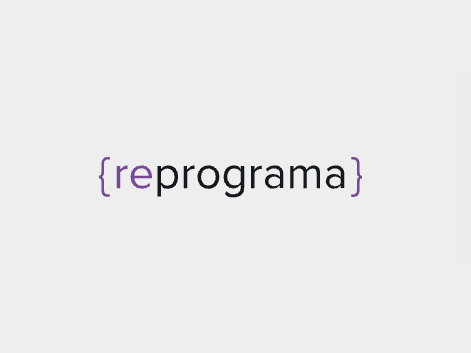
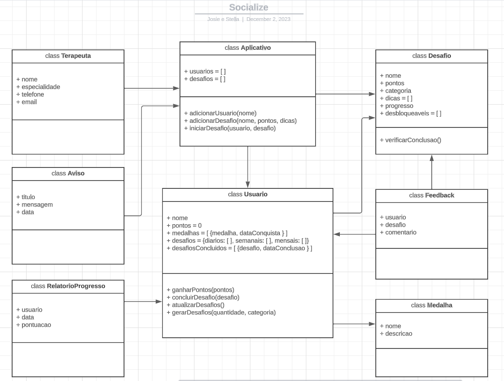
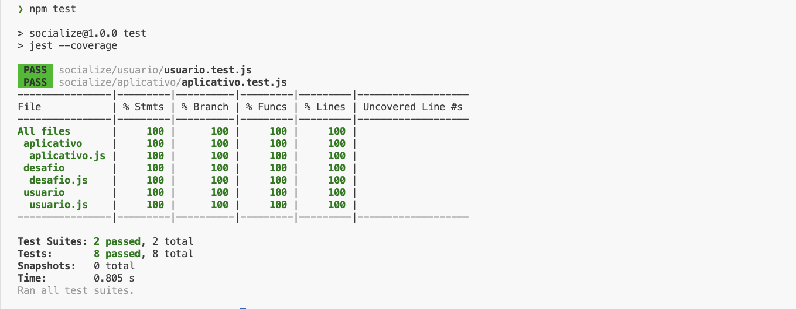

<h1 align="center">  </h1>

# Imersão JavaScript - Projeto Final

## Socialize - Superando a fobia social

📝 **Descrição do projeto**

<p align="justify"> 
O Socialize é um projeto desenvolvido como parte do curso de imersão em programação JavaScript da Reprograma abrangendo os princípios da Programação Orientada a Objetos (POO) e incorporando boas práticas de desenvolvimento, incluindo cobertura de testes unitários em Jest. O projeto é uma iniciativa que surge como resposta ao desafiador panorama da fobia social, um transtorno que impacta significativamente milhões de pessoas.</p>

<p align="justify"> O projeto propõe um ambiente virtual gamificado com uma abordagem estruturada para auxiliar na superação gradual dos problemas relacionados à fobia social. Buscamos proporcionar interações sociais personalizadas, incentivando uma jornada positiva em direção à superação dos desafios associados a esse transtorno.</p>

---

# Documentação

- [Problema](#problema)
- [Solução](#solução)
- [UML](#uml)
- [Implementação Futura](#Implementação)
- [Rodando os testes](#Rodando)
- [Testes](#testes)
- [Tecnologias](#tecnologias)
- [Autoras](#autora)

---

## Problema

<p align="justify"> As estatísticas da Organização Mundial da Saúde (OMS) indicam que o Brasil é o país mais ansioso e estressado da América Latina, com a fobia social afetando cerca de 13% da população, totalizando 26 milhões de pessoas. Segundo o jornal brasileiro de psiquiatria, o transtorno de ansiedade social (TAS), ou fobia social, é essencialmente o “medo ou ansiedade acentuados ou intensos de situações sociais nas quais o indivíduo pode ser avaliado pelos outros”. É insistentemente confundido com timidez ou com outros transtornos de ansiedade. Apesar disso, apresenta uma distribuição epidemiológica relevante nas populações ocidentais e um quadro de desenvolvimento persistente durante a juventude, podendo associar-se a outros transtornos de ansiedade.</p>

<p align="justify"> Segundo um artigo publicado na Revista Brasileira de Psiquiatria de 2008, pessoas com TAS comumente desejam evitar situações sociais que os possam expor, superdimensionando situações por meio da ansiedade e/ou do medo. Quando ocorre, ou na iminência de ocorrer, experimentam sintomas físicos e/ou emocionais, como sudorese e dificuldade de concentração. A evitação costuma estar relacionada à possibilidade de receberem atenção, se exporem ou serem avaliados. Costumam apresentar baixa autoestima e alta autocrítica. Além disso, costuma afetar mais as mulheres e pode ser mais severo nesse grupo.</p>

---

## Solução

<p align="justify"> Com base no problema exposto, a solução consiste em um aplicativo que utiliza princípios da Programação Orientada a Objetos (POO) para criar uma experiência interativa. Os usuários podem participar de desafios diários, semanais e mensais projetados para expô-los a situações sociais progressivamente desafiadoras. A aplicação recompensa os usuários com pontos, medalhas e feedback positivo, incentivando a continuidade da participação e a superação gradual da fobia.</p>

<p align="justify"> A estrutura do projeto inclui as classes Usuario, Desafio, Medalha, Feedback, Aviso, Aplicativo, Terapeuta e RelatorioProgresso, todas interagindo harmoniosamente para criar uma experiência abrangente e personalizada.</p>

---

## UML

<h1 align="center">  </h1>

---

## Implementação futura

<p align="justify"> Planejamos desenvolver um front-end intuitivo e responsivo, um servidor robusto e confiável, integrar um banco de dados dinâmico e implementar um sistema de autenticação seguro. Adicionalmente, teremos como objetivo implementar mais classes, como por exemplo, classe de feedback, sistema de avisos e promover interações sociais e colaborativas entre usuários. Prevemos a inclusão de um relatório de progresso detalhado, oferecendo insights sobre o desenvolvimento pessoal dos usuários. Estas são algumas das funcionalidades planejadas, reforçando nosso compromisso com a evolução constante do Socialize.</p>

---

## Rodando os testes

Para rodar os testes, rode o seguinte comando

```bash
  npm test
```

---

## Testes

<p align="justify"> Os testes unitários em Jest atingiram uma cobertura total de 100% para as funcionalidades do usuário e do aplicativo. Cada aspecto do código foi minuciosamente testado, garantindo não apenas a correção, mas também a confiabilidade de todas as operações.</p>

<h1 align="center">  </h1>

---

## Tecnologias

- [Jest](https://jestjs.io/pt-BR/)
- [JavaScript](https://developer.mozilla.org/en-US/docs/Web/JavaScript)
- [Visual Studio Code](https://code.visualstudio.com/)

---

## Autoras

- [@Joseane-Guedes](https://github.com/Joseane-Guedes)
- [@StellaLunaSousa](https://github.com/StellaLunaSousa)

## Licença

[MIT](https://choosealicense.com/licenses/mit/)

---

Feito com 💜 por [ Stella Luna ](https://www.linkedin.com/in/stellalunasousa/) e [ Joseane Guedes ](https://www.linkedin.com/in/joseane-guedes/)
